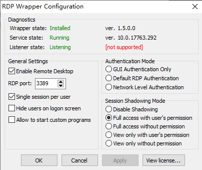
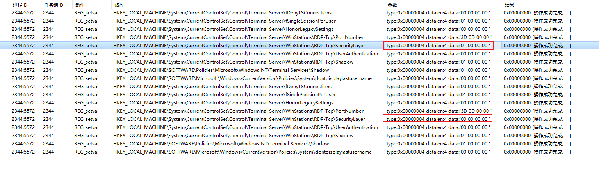

# 通过 rdpwrap 获取配置远程桌面时的具体操作

## 0x00 背景介绍

一位大兄弟遇到了一个奇葩环境, cs上线后, 发现是个Administrator账号, 但是权限是受限的, 情况如下

- Windows server 2012 r2
- 可以读写系统目录文件
- 无法运行powershell
- 提权工具提权失败

所以想到 粘滞键后门 拿到的权限是 system, 而且只需要能连rdp就可以, 所以进行尝试

但是实际尝试时发现, rdp只能登录成功后才能进入远程界面, 也就无法使用粘滞键后门

就想应该是注册表的什么位置影响了这个, 但是又不知道搜索的关键词是啥, 想到之前用的一个工具 [rdpwrap](https://github.com/stascorp/rdpwrap) 可以设置这些

于是就掏出火绒剑, 监控注册表 的 REG_setval 操作

发现在 `Authentication Mode` 从 `Default RDP Authentication` 设置为 `GUI Authentication Only` 的时候, 
HKLM\System\CurrentControlSet\Control\Terminal Server\WinStations\RDP-Tcp.SecurityLayer 的值从1变成0, 于是破案
