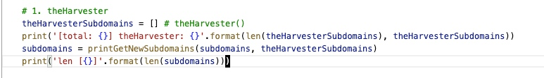

# 信息收集

## Google Dork

[what is Google Dork](https://zhuanlan.zhihu.com/p/32074947)

[原项目](https://github.com/nerrorsec/GoogleDorker)
[改进版-by safe6Sec](https://github.com/safe6Sec/GoogleDorker)

## 子域名收集

[OneForALL](https://github.com/shmilylty/OneForAll)


## 邮箱收集

1. theHarvesting

[theHarvester](https://github.com/laramies/theHarvester)

```bash
theHarvester -d <DOMAIN> -b <ENGINE>
```

工具通过搜索 @xxx.xx 对相关的邮箱进行收集

2. 水泽

[Shuize](https://github.com/0x727/ShuiZe_0x727)

水泽有使用 chinazApi 对公司信息和公司所属顶级域名进行查询



水泽中调用 theHarvester 的代码已经被注释掉， 启用后， 会有一点语法错误
水泽中的theHarvester被去掉了显示信息，方法入口阉割为仅domain参数做domain查询(-d -b)
且水泽并没有发现baidusearch.py中的错误

水泽有针对收集到的邮箱进行真实性验证


3. teemo 借鉴了 theharvester的代码

[teemo](https://github.com/bit4woo/teemo)

	⁃	补充了 ask, dogpile, duckduckgo, sogou, yahoo, yandex 等引擎

4. verifyemail 验证邮箱是否存在的脚本

[verifyemail](https://github.com/Tzeross/verifyemail)


## git信息收集

online code repositories, such as GitHub, GitLab, SourceForge

github's search doc: https://help.github.com/en/github/searching-for-information-on-github/searching-code

tools: 

- [Gitrob](https://github.com/michenriksen/gitrob) 可以以(批量)git账号或组织作为扫描目标, 收集账号名下的仓库信息为主，且有较为直观的web界面; 但是仓库维护的规则过于简单，主要为包含敏感信息的文件类型
- [Gitleaks](https://github.com/zricethezav/gitleaks) 仅以仓库作为扫描目标, 维护有比较详细的平台 token 规则
- recon-ng github modules
    - recon/repositories-profiles/github_commits, 使用github_api，收集仓库的 contributor
    - recon/companies-multi/github_miner, 给定公司/组织名， 获取该组织下的员工，项目信息
    - recon/profiles-contacts/github_users，根据username查询其他信息
    - recon/profiles-profiles/profiler，根据id去收集到的各个网站查询该id是否在其他站上有相同账号，[列表](https://raw.githubusercontent.com/WebBreacher/WhatsMyName/master/web_accounts_list.json), 这一项并不属于git信息泄漏
    - recon/profiles-repositories/github_repos，查询账号的git仓库
    - recon/repositories-vulnerabilities/gists_search.py, 从收集到的gists中查找关键词， 默认列表在 ~/.recon-ng/data/gist_keywords.txt
    - recon/repositories-vulnerabilities/github_dorks.py， 从收集到的repo中做关键词搜索， ~/.recon-ng/data/github_dorks.txt
- 水泽，get_GitSensitiveInfo, 首先使用 githubapi 查询（q = domain, type=Code)，使用正则搜索查询结果中的子域名，并保存 'html_url' 指向的页面内容进行敏感信息查询，关键词量很少
- [Shhgit](https://github.com/eth0izzle/shhgit) 存有较多敏感信息的正则


## 威胁情报框架

Recon-NG，Maltego，Creepy，Metagool，Tinfoleak，EmailHarvester，Harvester，SpiderFoot，ExifTool


TODO：
>     用户输入域名，反查公司，再查同公司备案域名，以这些根域名为结尾的邮箱。


## 信息收集小工具

关于信息收集， 主要查看了recon-ng 这一个信息收集框架 和 gitrob， gitleaks， 水泽-github信息收集部分， shhgit等几个github信息收集相关的项目/模块

目前比较推荐 recon-ng， 框架设计简洁， 方便二次开发和扩展， 情报分类， api key管理做的比较好， 各种数据存在本地关系型数据库，也方便前端取用

github信息收集方面：

1. recon-ng: 基本为使用githubapi进行花式查询个人，公司/组织， 仓库贡献者等信息
2. gitrob： 类似于 recon-ng的 recon/profiles-repositories/github_repos， 多了一些含有敏感信息的文件类型的判断规则
3. gitleaks: 以仓库作为扫描目标，有比较多 key 和 token的判断规则
4. 水泽： 首先使用 domain为关键词， 在github搜索代码， 然后通过正则提取公司子域名(可以扩展为邮箱收集)，并将相关代码片保存到本地后进行敏感关键词查询，但是先后两个查询并没有什么关联， 敏感词查询效果存疑，但是可以借用相关思路， 扩展为收集关键词相关的仓库后， 从中提取敏感信息
5. shhgit： 代码扫描， 保存有较多敏感信息的正则
 

建议方案：

1. 以 recon-ng为基础，进行payload扩展。 前端将其常用操作包装起来， 前端仅需要输入选择， payload选择， 数据展示即可; 输入和数据展示可直接读取本地数据库， payload选择可直接读本地payload目录结构， 解析payload中的info信息即可
2. 将 gitrob 的敏感类型文件判断规则抽成一个 recon-ng 的 敏感类型文件收集插件
3. 将 gitleaks 的 token/key 提取抽成一个 recon-ng 的 token收集插件
4. 水泽的 github使用方式类似于 theHarvester，可以将这一部分集成到邮箱信息收集小插件
5. shhgit的正则抽成一个信息收集插件 repo-mult/vuln

### 工具设计

InformationCollector
 - Core
     - SearchEngine --> recon-ng
 - modules
     - domains-contacts
         -  recon/domains-contacts/hunter_io, req: hunter_io_key

         
         
TODO:
    1. proxy(base.py:86 _init_global_options)
    2. user-agent(base.py:86 _init_global_options)
 
 