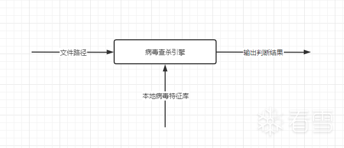
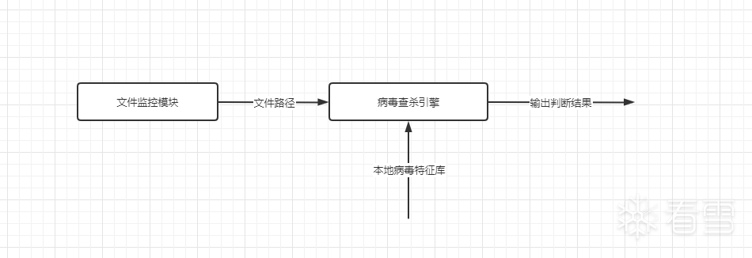
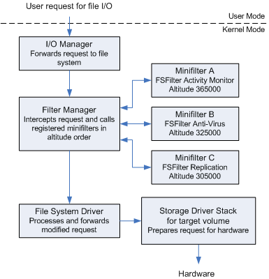
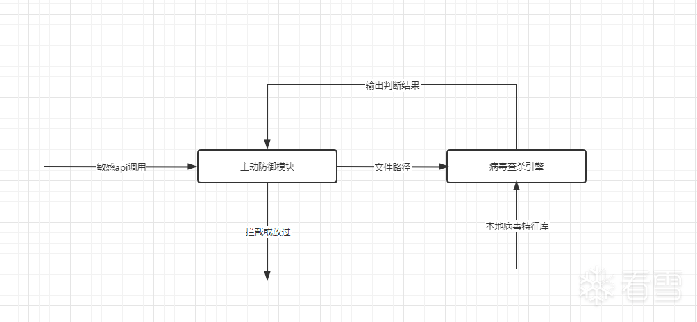
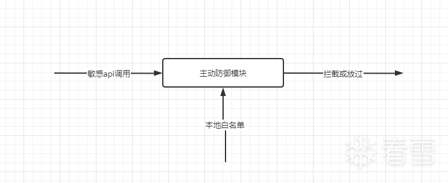
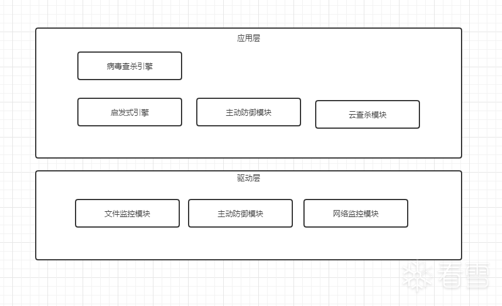

# [关于免杀的一些思考](https://bbs.pediy.com/thread-270944.htm)

关于免杀的一些思考
1、序
关于免杀，市面上已经有很多教程教人如何bypass了，但是基本都是直接上手操作，如加壳、改资源、改区段、分离加载等等，很少有文章系统性的介绍原理。本文主要是网上查阅相关资料同时结合笔者自身的一些经验后猜测得出，不能保证完全的准确性。描述有误的还请各位大佬指出。最后希望本文能给大家带来一些思路上的启发，同时促进一下业内交流。

2、杀毒软件的架构
未知攻，焉知防，这句话反过来也可用于免杀这一块。这一节我们先从架构层来解剖杀软，从简单到复杂的介绍杀软的各个模块。

2.1 病毒查杀引擎
作为一个最简单的杀软软件，病毒查杀引擎一定是最基础的部分。



 
病毒查杀引擎的功能就是来判断一个文件是否是病毒，所以他需要提供一个接口，杀毒软件传入一个路径，接口返回检测的结果。这样一个简陋的杀软就这样诞生了。但是我们也能发现一个问题，单独的查杀引擎还不能实现实时的病毒查杀。这也是早期的杀软软件需要定期手动执行的原因，那么，我们就需要再引入一个监控模块，来监控操作系统上的文件读写与执行。

2.2 文件监控模块



文件监控模块，通常由微软提供的minifilter框架实现，通过驱动向内核注册一系列的文件操作回调，来监控整个系统的文件操作。



minifilter提供了很多的回调类型，这一点可以在杀软的监控级别的设置里可以发现。


 
有了这两个模块，理论上已经实现了整个操作系统的实时监控了，但相对的，无文件（Fileless）和不落地（Living off the Land）攻击已经非常流行，几乎成为攻击者的标配。
对于内存执行的攻击，已经完全绕过了minifilter的监控范围，那么就更不可能被病毒查杀引擎检测到，所以杀软需要一个新的模块来对抗这种基于内存的攻击技术。

2.3 主动防御模块

对恶意软件来说，无论是exe dll 还是 shellcode的形式，如果要实现功能，必定是要调用api，所以只要对api进行监控，就可以在程序执行前的一个瞬间，获得一个捕获病毒的机会。
常规上来说，主动防御捕获到高危api调用后，应该把进程路径传递给病毒查杀引擎进行检测，根据返回的查杀结果来进行相应的处理。



而实际上，某些杀软最终做成了白名单的判断逻辑，这样处理有两个好处，一个是会有更好的查杀效果（普通用户使用的软件也就是常见的那几个），另一个是能作为产品运营的一部分（要吃饭的嘛）。



 
基本上有了以上3个模块，杀软产品就已经初步成型了。不过我们也可以发现此时的杀毒软件依然是落后与病毒的，也是就是先捕获样本，再分析提取特征码，才能对一个病毒进行查杀，这肯定是不能应对目前的越来越严峻的安全威胁的。
所以安全厂商是怎样在捕获样本之前就能对某种病毒进行查杀，来未雨绸缪的呢？

2.4 云查杀模块
这个模块就比较好理解了，就是本地把可疑样本上传到云后台分析，后台分析可能是沙盒执行，可能是机器学习，也可能是人工分析。不过这个模块不一定能实时的查杀本地病毒。
举个例子：同一个病毒样本，会有用户A云查杀的结果为安全无风险，但3天后用户B云查杀的结果为病毒的情况。

2.5 启发式引擎模块
这个模块可以看作一个高级版的病毒查杀引擎，但它的判断逻辑是基于机器学习训练出来的模型，而不是手工提取的特征码，由于同一个类型的病毒是有一定的同性的，这样训练出来的模型就能对一整个类型的病毒进行识别，不过基于启发式引擎扫描的结果存在一定的误报率不是100%的正确。

2.6 网络流量检测模块
这个模块主要是过滤网卡的流量，主要是2个防护的功能。

对漏洞的poc流量的拦截，比如是msf的攻击流量，识别后可以对内网机器的ip进行报警。
与安全公司的威胁情报相结合，监控进程是否有连接高危ip。
2.7 总结
基于以上的讨论，我们可以大致得出一个杀软架构如下图所示。



3、免杀三板斧
对于免杀，我们多半是对自身程序具体被那个模块查杀了并不清楚，但是我们可以从查杀的现象来进行一个逆向推导，我在这里将被杀情况分为3种，上传被查杀、执行时被查杀、和执行后过了一段时间被查杀。

3.1 上传被查杀
上传就被查杀，这个就很明显是静态扫描都没过掉，也是就被病毒查杀引擎或者启发式引擎查杀了。那么它是扫描的哪里呢？
对于病毒查杀引擎，每个公司都是有一套自己的闭源引擎，但是必定有是有一套规则来给引擎做匹配，这里我们可以参考开源引擎yara的规则部分，主要有2种规则匹配。

```yara
rule APT9002Code
{
 
    meta:
        description = "9002 code features"
        author = "Seth Hardy"
        last_modified = "2014-06-25"
 
    strings:
        // start code block
        $ = { B9 7A 21 00 00 BE ?? ?? ?? ?? 8B F8 ?? ?? ?? F3 A5 }
        // decryption from other variant with multiple start threads
        $ = { 8A 14 3E 8A 1C 01 32 DA 88 1C 01 8B 54 3E 04 40 3B C2 72 EC }
 
    condition:
        any of them
}
 
rule APT9002Strings
{
 
    meta:
        description = "9002 Identifying Strings"
        author = "Seth Hardy"
        last_modified = "2014-06-25"
 
    strings:
        $ = "POST http://%ls:%d/%x HTTP/1.1"
        $ = "%%TEMP%%\\%s_p.ax" wide ascii
        $ = "%TEMP%\\uid.ax" wide ascii
        $ = "%%TEMP%%\\%s.ax" wide ascii
        // also triggers on surtr $ = "mydll.dll\x00DoWork"
        $ = "sysinfo\x00sysbin01"
        $ = "\\FlashUpdate.exe"
 
    condition:
       any of them
}
```
字符串
二进制代码

3.1.1 排查
可以先对代码中的所有字符串进行注释，排查是否有敏感字符串。
如果没有敏感可以再对代码进行注释二分查找。
如果都没有问题，那么就是启发扫描的原因。

3.1.2 绕过
对于字符串被杀，可以对其进行加密，使用时在解密。
对与二进制代码被杀，可以加入花指令、混淆，或者修改代码逻辑。
对与启发扫描，可以对程序添加资源、图标、描述信息、签名等等来增加程序的可信度，或者直接shellcode执行。
总的来说：分离加载是一劳永逸的方案。

3.2 执行时被查杀
执行时被查杀，这就是100%的被主动防御拦截了。

3.2.1 原理
对于Windows API的调用，最终会由ntdll.dll转入内核，那么只要hook掉ntdll导出的函数就能对api的调用进行监控。hook ntdll的技术也分为应用层和内核层。
对于应用层，可以直接inline hook jmp到自己的hook函数就行。
对于驱动层，x32系统可以使用hook ssdt函数来进行监控，x64系统由于PatchGuard机制的存在是不能直接hook的，但是也会有一些骚操作来绕过pg实现hook，比如ETW（https://bbs.pediy.com/thread-258352.htm）、VT（360核晶）。

3.2.2 绕过
对于应用层hook的杀软，直接系统调用是最好的选择，具体实现有两种方案：

自己用汇编实现一遍api的代码，直接从ida里复制就行。
手工map一份ntdll到内存，然后调用这段内存里的接口（Themida的实现方案）。
对于驱动层hook的杀软，在应用层基本上是无能为力的，最多就是能找一个白名单的进程，在它内部调用是最好的。（白加黑）

3.3 执行后被查杀
这种情况就是程序被后台上传到云端，被丢进了样本集中训练，如果需要绕过它，就需要了解一下机器学习。
机器学习的诞生，是用来解决算法解决不了的问题，需要靠样本来训练，而且只能解决一种问题，比如用来做人脸识别的样本是识别不了花的品种的。那么绕过机器学习的方法，就是产生一个机器不认识的程序。
换句话说也就是一个非常规的pe文件结构(混淆)，现成的方案有：

花指令
虚拟机
使用其他编译型语言，依靠自身编译器的特性，产生特定的pe文件结构
自实现编译器，这个就有点扯了，不过实现OLLVM的IR是具有可行性的
4、展望
以上是我本人对C/C++免杀的一些思考，对于真正的一线实战，早已不局限于此。基于powershell .net python等非编译型语言的代码，反而在解释器（正规签名，自带白属性）的保护下能有更大的操作空间。不过我对此也还没有开始进行深入研究，希望有机会和大家一起交流。

 
免责声明：此文章只在看雪论坛发布，只可用于看雪论坛的朋友交流学习，禁止任何人转载到其他站点，禁止用于任何非法用途。如有任何人凭此做何非法事情，均于本人无关，特此声明。