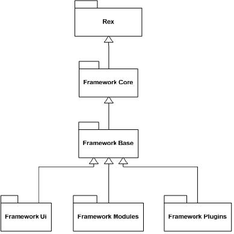

# Design and Architecture

## Framework(metasploit-framework/lib)

### Rex(Ruby Extension Library)

- wrapper socket subsystem
- implementations of protocol clients and servers
- a logging subsystem
- exploitation utility classes
- a number of other useful classes

#### Assembly

### framework core(metasploit-framework/lib/msf/core)

The framework core is responsible for implementing all the required interfaces that allow for interacting with exploit modules, sessions, and plugins

### framework base(metasploit-framework/lib/msf/base)

An extension for the framework core which is designed to provide simpler wrapper routines for dealing
with the framework core as well as providing utility classes for dealing with
different aspects of the framework, such as serializing module state to different
output formats

### framework ui(metasploit-framework/lib/msf/ui)

An extension for the framework base, support for the different types of user interfaces to the framework
itself, such as the command console and the web interface

## Modules

### exploit

### payload

### encoder

### NOP generator

### auxiliary