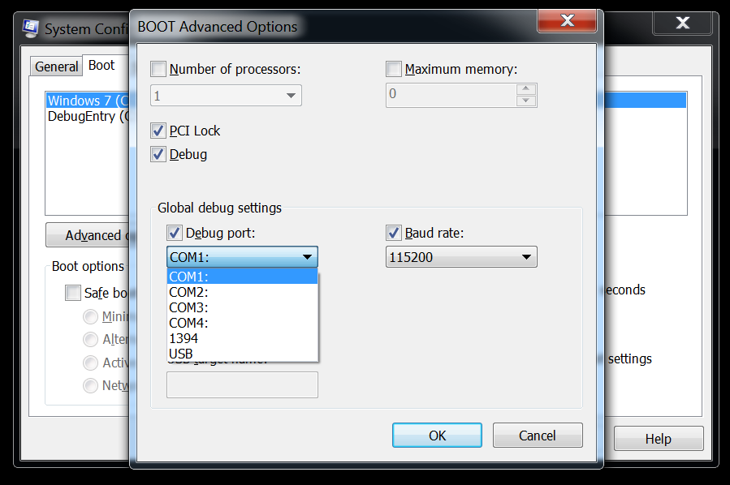

# WinDbg

记录一下windbg的使用, 其实我很久之前搞过双机调试, 而且当时挺顺利的, 这次就非常不顺利....

其实网上挺多教程的, 但感觉好多都是面向纯纯小白的, 这里还是记录一些差异点吧

1. 配置失败删除打印机 

很多教程上来直接让删除虚拟打印机, 这是因为打印机也是一个com设备, 如果不删除的话, vmware 创建的com设备就是 `Serial Port2`, 如果还有其他设备的话, 这个数字还会增加
教程上让吧其他com设备删掉, 应该是防止小白看不明白, 引发更多问题, 其实只要被调试端写好对应的端口就行



2. 连上目标机器后, WinDbg没反应

其实只要WinDbg下面显示 `Debuggee is running...` 就时跑起来了, 想要命令输入窗口, 需要按一下上面菜单栏的Break按钮, 快捷键 `Ctrl + Break`, 虽然我也没找到键盘的Break键在哪..., 此时目标机器会暂停, 使用go(g)命令恢复运行

3. 通过方法名设置地址断点时, 显示: *Bp expression '**' could not be resolved, adding deferred bp*

`reference 2`

这是因为没有切换到用户环境, 可以通过在WinDbg输入以下命令

```bash
kd> !process 0 0 explorer.exe
PROCESS 81fff020 SessionId: 0 Cid: 0600 Peb: 7ffde000 ParentCid: 05f0
DirBase: 048401c0 ObjectTable: e19d5188 HandleCount: 371.
Image: explorer.exe

.process /p /r 81fff020
Implicit process is now 81fff020
.cache forcedecodeuser done
Loading User Symbols
..................................................
```

.process命令的功能是在内核态调试时，切换进程CONTEXT。是调试用户态模块所必须的命令，因为用户态模块必然是在进程环境中运行的。使用.process命令时需注意，在切换到目标进程空间后必须强制加载user模块的pdb文件。
在;运行.process /i; g，等待中断后使用.reload /i /user或.process 时使用/p /r参数。否则lm不能列出进程实际已经加载的用户态模块，lm u结果会为空。下用户态程序断点，查看内存等操作都无法进行。

这里切换到其他的用户进程空间也可以，然后就可以对R3函数下断了

4. 断点相关操作
  
`reference 3`

- bp, 下地址断点
- bu, 下符号断点
- bm, 支持正则的符号断点
- ba, 下数据断点
- bl, 列出所有断点
- bc, 清除断点
- bd, 禁用断点
- be, 启用断点

5. 驱动相关

- !drvobj drivrName, 查看加载驱动的驱动对象信息
- !devobj, 显示设备对象信息 
- !devstack, 显示设备对象堆栈
- !devhandles, 获得拥有这个设备句柄的所有用户态应用程序列表
- !devnode, 显示设备节点
- !object \Driver, 浏览驱动对象
- !object \Device, 浏览设备对象
- dt nt!_DRIVER_OBJECT 查看驱动数据结构
- [IRP_MJ 相关](https://docs.microsoft.com/zh-cn/windows-hardware/drivers/ddi/wdm/ns-wdm-_irp)

- d    - 该命令按照上一个d*命令的同样格式显示数据. 如果前面没有d*命令的话, 它跟db的效果相同.
- da  - ASCII 字符. 每行最多显示48个字符. 直到遇到一个null字节, 或者指定的范围内的所有字符都已经被显示. 所有无法打印的字符都会被显示为" . "
- db  - 字节值或ASCII字符. 默认长度为128字节.
- dc  - 双字(4字节)值和ASCII字符. 默认长度为32 DWORDs(128字节)
- dd  - 双字(4字节). 默认长度为32 DWORDs(128字节)
- dD  - 双精度浮点数(8字节). 默认15个数字(120字节)
- df   - 单精度浮点数(4字节). 默认16个数字(63字节).
- dp  - 指针大小的值. 相当于dd或dq, 具体取决于计算机的处理器架构是x86还是x64. 默认长度32个双字, 或16个四字(128字节).
- dq  - 四字值(8字节). 默认16四字(128字节).
- du  - Unicode字符. 每行显示至多48个字符. 直到遇到一个null字节, 或者指定的范围内的所有字符都已经被显示. 所有无法打印的字符都会被显示为" . "
- dw  - 字值(2字节). 默认显示64个字(128字节).
- dW - 字值(2字节)和ASCII字符. 默认64个字(128字节).
- dyb - 二进制值和字节值. 默认32个字节.
- dyd - 二进制值和四字值(4字节). 默认是8个双字(32字节).
- ds,
- dS,

6. lm, list module, 查看模块及模块的符号加载情况 
    - lm l, 查看已加载符号的模块
    - lm m moduleName, 查看指定模块
    - lm v, 查看所有模块及一些详细信息
    - !lmi moduleName, 查看指定模块详细信息
    - !dh module Start Address | module Name -f, 进一步查看模块头部信息, pdb信息, 默认分配堆栈大小等
    - lmD 查看所有模块

7. 中断相关
   - ！idt, 查看中断描述表

8. 插件相关

- .chain 查看加载的插件
- .load
- .unload
- 加载自定义插件: `_NT_DEBUGGER_EXTENSION_PATH` 或 `.extpath <ExtensionPath>`
- ! module.extension, 执行扩展命令
- !help, ! module.help, 查看模块的帮助信息, 如果不指定module, 则会执行第一个加载的模块的help, 通常为 exts

9. 其他操作

- u moduleName!symbolName, 查看符号汇编
- x, 通配符搜索函数或符号
- ln, list near, 显示给定地址处的或者最近的符号
- dt, display type, 查看数据结构的类型信息, usage: dt ModuleName!symbolName [struct address]

8. tips

- bu $iment(moduleName), 在模块入口点下断点

## reference

1. 恶意代码分析实战
2. [windbg双机调试时对R3函数下断](https://blog.csdn.net/iteye_10992/article/details/82201812)
3. [WinDBG 技巧：设断点命令详解(bp, bu, bm, ba 以及bl, bc, bd, be)](https://blog.csdn.net/WinGeek/article/details/4025475)
4. [windbg调试命令5(ln、伪寄存器)](https://www.cnblogs.com/guanlaiy/archive/2012/12/18/2823649.html)