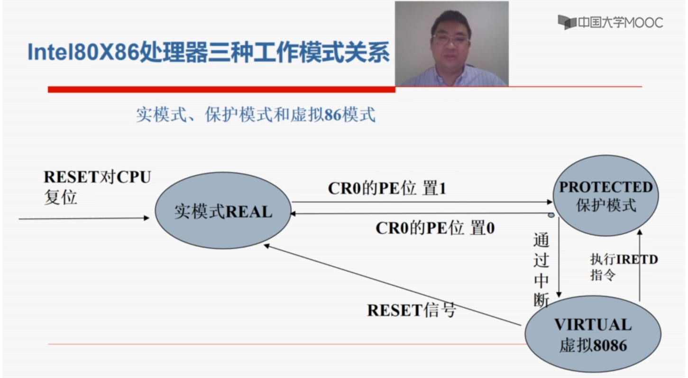
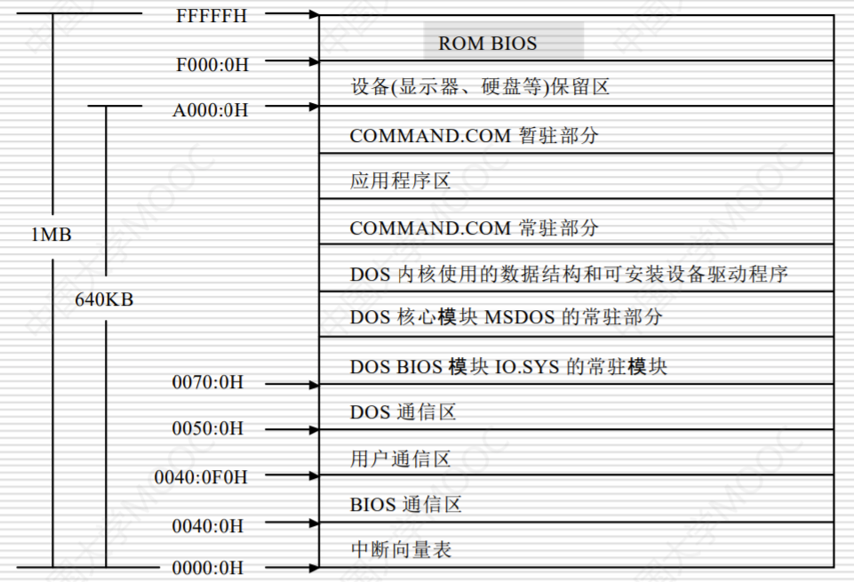
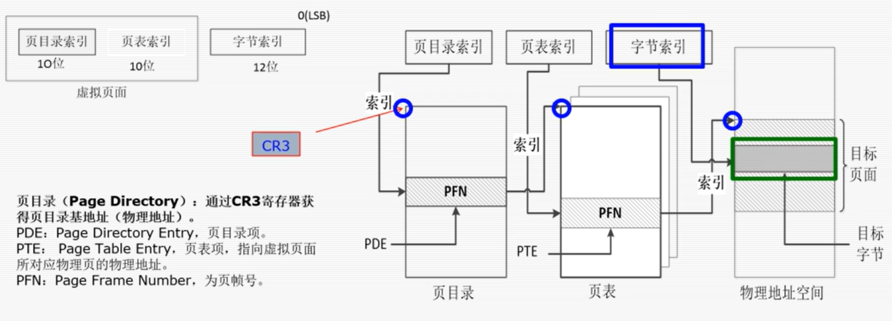

# C2 计算机引导与磁盘管理

## 系统引导与控制权

### 计算机系统引导过程

1. BIOS: Basic Input and Output System. 为计算机提供最底层的， 最直接的硬件设置和控制

2. BIOS引导模式

    - 传统BIOS： 开发效率低， 性能差， 扩展性差
      - 开机 -> BIOS初始化 -> POST 自检 -> MBR(硬盘主引导程序) -> DBR(活动分区引导程序) -> bootmgr/NTLDR(操作系统引导) -> 读取BCD/boot.ini -> 启动对应系统(操作系统内核启动 -> 驱动程序及服务 -> 系统自启动程序)
    - UEFI: Unified Extensible Firmware Interface. 支持 GPT， 取消了POST自检
      - 开机 -> BIOS初始化 -> ESP分区 启动管理器(EFI分区bootxxx.efi) -> 读取BCD -> 调用对应系统盘 winload.efi -> 启动对应系统

    tips: `Msinfo32.exe` / `bcdedit.exe` 可查看系统BIOS信息

3. BIOS的自检与初始化工作

    关键设备检查并初始化， 并将控制权交给后续引导程序

4. 硬盘主引导程序

    位置: MBR, Master Boot Record, 硬盘第一个扇区
    功能: 通过主分区表中定位活动分区. 装载活动分区的引导程序， 并移交控制权

5. 活动分区引导程序

    位置: DBR(Dos Boot Record), 或 OBR(OS Boot Record), 或 PBR(Partition Boot Record), 分区引导记录. 分区的第一个扇区
    功能: 加载操作系统引导程序. windows xp 系统的NTLDR, windows Vista及以后的BOOTMGR

6. 操作系统引导(NTLDR)

    1. 将处理器从16位扩展为32、64位内存模式
    2. 启动小型文件系统驱动， 以识别FAT32和NTFS文件系统
    3. 读取boot.ini, 进行多系统选择(或hiberfil.sys恢复休眠)
    4. 检测和配置硬件(NT或XP系统, 则运行NTDETECT.COM， 其将硬件信息提交给NTLDR, 写入 "HKEY_LOCAL_MACHINE" 中的Hardware)

7. 系统内核加载

    1. NTLDR 加载内核程序 NTOSKRNL.EXE 及硬件抽象层 HAL.dll 等
    2. 读取并加载 HKEY_LOCAL_MACHINE\SYSTEM\CurrentControlSet 下指定的驱动程序
    3. NTLDR将控制权传递给NTOSKRNL.EXE 引导结束

8. Windows系统装载

    1. 创建系统变量
    2. 启动win32.sys (windows子系统的内核模式部分)
    3. 启动csrss.exe(windows子系统的用户模式部分)
    4. 启动winlogon.exe等

    至此，显示开机logo

9. Windows系统装载-登录阶段

    1. 启动需要自启动的windows服务
    2. 启动本地安全认证 Lsass.exe
    3. 显示登录界面等

10. Windows 登录之后

    1. 系统启动当前用户环境下的自启动项程序
        - 注册表特定键值
        - 特定目录(如startup)等
    2. 用户触发和执行各类程序

11. 系统引导与恶意软件的关联

    1. 在计算机引导阶段获得控制权 Bootkit(BIOS木马, MBR木马)， CIH病毒
    2. 在系统启动阶段获取控制权, 一般为依赖系统自启动相关机制的独立程序
    3. 在应用程序执行阶段获得控制权, 最常见的文件感染型病毒启动方法

## 80X86 处理器的工作模式

1. 实模式

    - 80x86处理器在复位或加电时是以实模式启动的
    - 寻址方式: 20位寻址(段 + 偏移), 1M空间
    - 不能对内存进行分页管理
    - 不支持优先级, 所有指令相当于工作在特权级(优先级0)
    - 切换到保护模式: 通过在实模式下初始化控制寄存器, GDTR, LDTR等管理寄存器以及页表, 然后再置位CR0寄存器的保护模式使能位(PE: Protected-Mode Enbable, 第0位)

2. 保护模式

    - 常态工作模式
    - 32位处理器支持32位寻址, 物理寻址空间为4G
    - 支持内存分页机制, 提供了对虚拟内存的良好支持
    - 支持优先级机制, 根据任务特性进行了运行环境隔离
    - 切换到实模式: 通过修改控制寄存器CR0的PE位切换到实模式

3. 虚拟8086模式

    - 为了在保护模式下兼容8086程序而设置的
    - 虚拟80x86模式是以任务的形式在保护模式上执行的, 在80x86上可以同时支持多个真正的80x86任务和虚拟80x86模式构成的任务
    - 支持任务切换和内存分页, 操作系统利用分页机制, 将不同的虚拟8086任务的地址空间映射到不同的物理地址上, 使得每个虚拟8086任务看来都认为自己使用0-1MB的地址空间

4. 三种模式关系

    实模式和虚拟8086模式是为了向下兼容8086处理器的程序而设计

    

## Windows 内存结构与管理

### 内存布局与页面地址切换

#### DOS实模式下的内存布局

中断向量表: DOS病毒比较关注的点, 拦截系统功能

#### Windows下的虚拟地址空间布局

1. 32位, 虚拟地址空间最大4G

    - [默认] 2G用户进程空间(低端 x0000 0000 - x7fff ffff), 2G系统空间(受保护, 高端 x8000 0000, xfff ffff)
    - [/3GB系统启动时的开关实现] 3G 用户空间, 1G系统空间

2. 64位

    - [x64] 8192 GB(8TB) 用户进程空间, 6657GB 系统空间
    - [Itanium] 7152 GB(7TB) 用户进程空间, 6144GB系统空间

3. CPU特权级与内存访问

    windows为了确保系统稳定性, 将处理器存取模式划分为用户模式(Ring3)
    - 用户应用程序一般运行在用户模式, 其访问空间局限在用户区
    - 操作系统内核代码(系统服务, 设备驱动程序) 运行在内核模式, 可以访问所有的内存空间(包括用户模式分区) 和硬件, 可以使用所有处理器指令

4. 用户区内存

    - 用户区是每个进程真正独立的可用内存空间, 进程中的绝大部分数据都保存在这一区域， 应用程序代码， 全局变量， 所有线程的线程栈以及加载的DLL代码等
    - 每个进程的用户区的虚拟内存空间相互独立， 一般不可以跨进程相互访问

    od, 用户态调试器， windbg, 内核态调试器

5. 内核区内存

    - 内核区所有数据是所有进程共享的， 是操作系统代码(操作系统内核代码， 与线程调度， 内存管理， 文件系统支持， 网络支持， 设备驱动程序相关的代码)的驻地
    - 此分区中所有代码和数据都被操作系统保护， 用户模式代码无法直接访问和操作， 如果应用程序直接对内存空间内的地址访问， 将会发生地址访问违规

6. windows分页机制

    - x86 windows 默认使用二级页表把虚拟地址转译为物理地址, 32位地址被划分为3个单独部分：页目录索引, 页表索引和字节索引
    - x86 系统上默认页面大小为4k, 故页内字节索引宽度为12位

#### 地址与物理地址的转换

1. 虚拟地址转译到物理地址的过程

    1. 概念, 32位
        - 2级页表
        - 页目录(Page Directiory): 通过 CR3 寄存器获得页目录基地址(物理地址)
        - PDE: Page Directory Entry, 页目录项
        - PTE: Page Table Entry, 页表项, 指向虚拟页面所对应物理页的物理地址
        - PFN: Page Frame Number, 页帧号, 低12位为页数性, 高20位为页帧号, 表示对应的物理页
        - CR3 寄存器: 指向页目录基地址的物理地址, 又页目录基地址寄存器PDBR(Page-Directory Base address Register)
        - 32位系统中的CR3寄存器, 低12位置零, 也是4k对齐的, 
        - PTE 第7位, PS = 1, 则为4M分页, 否则为4k分页
        - PAE, Physical Address Extension, 物理地址扩展
        - VPN, Virtual Page Number
        - VPO, Virtual Page Offset
        - PTBR, Page Table Base Register
        - PPN, Physical Page Number
        - TLB, Translation Lookaside Buffer, in MMU
        - Windbg 输入 !process 0 0 看到的 DirBase 一项即CR3
        - 如果物理内存大于4G
          - intel在处理器上把管脚数从32提升到36, 使内存寻址能力达到2^36=64G, 2(page-directory pointer table) + 9 + 9 + 12
          - 引入新的分页机制, PAE(Physical Address Extension)

    2. 概念, 64位
        - 4级页表
          - PML4T, Page Map Level4 Table
          - PDPT, Page Directory Pointer Table
          - PDT, Page Directory Table
          - PT, Page Table, 表内为 PTE
          - 9 + 9 + 9 + 9 + 12, 48bit

### Windows内存页面权限管理

1. 概念

    - 内核态的数据和代码是进程间共享的
    - 把权限从用户态提升到内核态的漏洞称为提权漏洞
    - 页面权限由PDE(1024个)和PTE(1024 * 1024 个)属性设置

2. 内存管理函数

    - VirtualAlloc  |   VirtualFree
    - VirtualLock   |   VirtualUnlock
    - VirtualQuery  |   VirtualQueryEx
    - VirtualProtect|   VirtualProtectEx
    - GetSystemInfo(at kernel32.dll)
    - GlobalMemoryStatusEx(at kernel32.dll)
    - Module32First/Next (at kernel32.dll)
    - Heap32First/Next (at kernel32.dll)
    - Process32First/Next (at kernel32.dll)
    - Thread32First/Next (at kernel32.dll)
    - CreateToolhelp32Snapshot (at kernel32.dll)

3. 内存中标志位含义

    - P, present
    - R/W, read/write
    - U/S, user/supervisor
    - PWT, write-through
    - PCD, cache disabled
    - A, Accessed
    - 0, Reserved(set to 0)
    - PS, Page size(0 indicates 4 kBytes)
    - G, Global page(ignored)
    - Avail, Available for system programmer's use 
    - 64位系统设置了 执行权限位

## 磁盘的物理与逻辑结构

1. 硬盘物理结构 略
2. 硬盘的逻辑结构
   1. 寻址方式: CHS/LBA Cylinder/Head/Sector | Logical Block Address

3. 硬盘分析工具： WinHex, 准确来讲， 是windows hex工具
4. 第一个扇区为主引导程度， 以 0x55AA结束
5. MBR 分区
6. GPT 分区， 超过4个主分区， 单分区容量大于2TB

## FAT32文件系统及数据恢复

### 概念

1. 簇 文件系统将磁盘空间以一定数目(2^n)的扇区为单位划分， 这样的单位为簇.
2. FAT(File Allocation Table)表是微软在FAT文件系统中用于磁盘数据(文件)索引和定位引进的一种单向链式结构

    - FAT 区用每一个FAT项来记录每一个簇的占用情况
    - FAT表中表项的个数 = 簇的个数
    - 如果为0， 则表示对应簇为空闲， 可存储数据
    - 表项大小: FAT32, 32位, 4字节. 最大簇号空间为4G
3. 簇链: 一个文件所占用簇的序号， 形成的单向链表. 实现方式: 在文件占用簇的对应簇号的FAT项， 填写下一个簇的簇号， 如果为最后一簇，则数据结束标识符"FFFFFF0F"

## NTFS文件系统

## 程序的二进制表示
